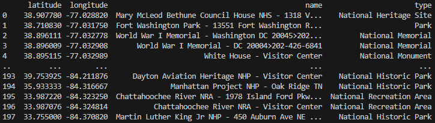

# Geospatial Point of Interest (POI) Classifier

## Objective

A geospatial point of interest (POI) classifier that takes in data points with
latitude, longitude, and name information and predicts the category of each
point of interest. This project demonstrates data preprocessing, feature
engineering, and classification using geospatial data.


Supported categories are: National Battlefield Site, National Battlefield,
National Heritage Site, National Historic Park, National Historic Reserve,
National Historic Trail, National Lakeshore, National Memorial, National
Military Park, National Monument, National Park, National Preserve, National
Recreation Area, National Recreational River, National River, National Scenic
River, National Scenic Trail, National Seashore, Other, Park, and Parkway.

## Data Source

National Parks, Monuments, Preserves, & Historical Parks from POI Factory:
http://www.poi-factory.com/node/31147

## Methods Applied

1. Data Collection: I gathered geospatial data points for different POIs. Each
   data point had latitude, longitude, and a name of the POI (e.g., Fort Dupont
   Park - 3600 F St SE Washington DC 20019>202-426-7723).
3. Data Preprocessing: I processed the data, handling missing values, removing
   duplicates, and performing any necessary data transformations. I added type
   information to categorize each point (e.g., National Park, National Heritage
   Site, etc.) for 80% of the data, reserving 20% for demonstration purposes.
4. Feature Engineering: I extracted relevant features from the geospatial data
   that could be useful for classification. In this case: latitude, longitude,
   and name, as they were the only data points available in the data.
5. Model Selection: I chose and implemented a random forest classifier using the
   popular machine learning library scikit-learn for Python.
6. Model Training: I split the data into training and testing sets and trained
   your classifier on the labeled data.
7. Model Evaluation: I evaluated the classifier's performance using appropriate
   metrics such as accuracy, precision, recall, and F1-score.
8. Real-world Usage: I used the trained model to classify the remaining 20% of
   data. The result is a complete set of national parks, monuments, preserves,
   and historical parks in the United States, classified with their type.
9. Data Visualization: I created a map of all POIs using Folium which colors
   each marker differently depending on the type. This includes the types from
   the predicted set.

## Prerequisites

- Python
- `scikit-learn`, `pandas`, and `folium` installed through `pip`
- If you want to use the pre-trained model on your own data: a CSV file
  containing latitude, longitude, and names of POIs
- If you want to train your own model: a CSV file containing latitude,
  longitude, name, and types of POIs
- If you want to use the same source data as I did: a copy of the data from [POI
  Factory](http://www.poi-factory.com/node/31147)

## Usage

Clone this repository

```sh
git clone https://github.com/travishorn/poi-classifier
```

Change into the directory

```sh
cd poi-classifier
```

### Train

If you want to train your own data, make sure the training set is a CSV file
named `poi_training.csv` with columns for `latitude`, `longitude`, `name`, and
`type`.

Train the model

```sh
python train.py
```

The script will reserve 20% of the training file for testing itself. Scores are
shown and `trained_model.pkl` is created (or overwritten).


### Classify

The trained model saved at `trained_model.pkl` can be used to classify types of
POIs. Make sure the "to classify" set is a CSV file named `classify.csv` with
columns for `latitude`, `longitude`, and `name`.

Predict (classify) the POIs

```sh
python classify.py
```

A sample of the predicions are shown and `poi_classified.csv` is created which
should mirror `poi_to_classify.csv`, but with a `type` column.



### Visualize

Generate a map of POIs using a combination of `poi_training.csv` and
`poi_classified.csv`, which should now include a complete set of national parks,
monuments, preserves, and historical parks in the United States. Each marker is
colored according to the POI's type (e.g., national scenic rivers are dark blue,
national memorials are beige, etc.).


## License

The MIT License

Copyright 2023 Travis Horn

Permission is hereby granted, free of charge, to any person obtaining a copy of
this software and associated documentation files (the “Software”), to deal in
the Software without restriction, including without limitation the rights to
use, copy, modify, merge, publish, distribute, sublicense, and/or sell copies of
the Software, and to permit persons to whom the Software is furnished to do so,
subject to the following conditions:

The above copyright notice and this permission notice shall be included in all
copies or substantial portions of the Software.

THE SOFTWARE IS PROVIDED “AS IS”, WITHOUT WARRANTY OF ANY KIND, EXPRESS OR
IMPLIED, INCLUDING BUT NOT LIMITED TO THE WARRANTIES OF MERCHANTABILITY, FITNESS
FOR A PARTICULAR PURPOSE AND NONINFRINGEMENT. IN NO EVENT SHALL THE AUTHORS OR
COPYRIGHT HOLDERS BE LIABLE FOR ANY CLAIM, DAMAGES OR OTHER LIABILITY, WHETHER
IN AN ACTION OF CONTRACT, TORT OR OTHERWISE, ARISING FROM, OUT OF OR IN
CONNECTION WITH THE SOFTWARE OR THE USE OR OTHER DEALINGS IN THE SOFTWARE.
